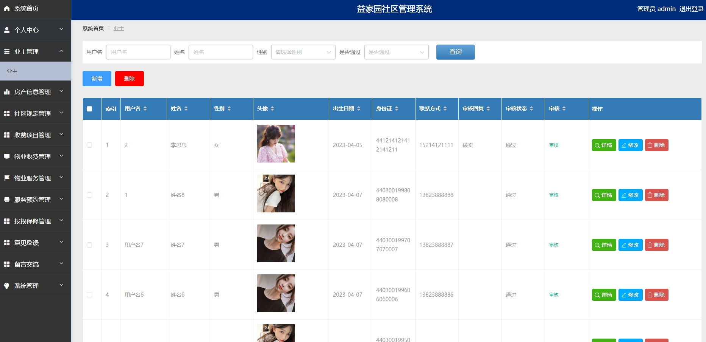
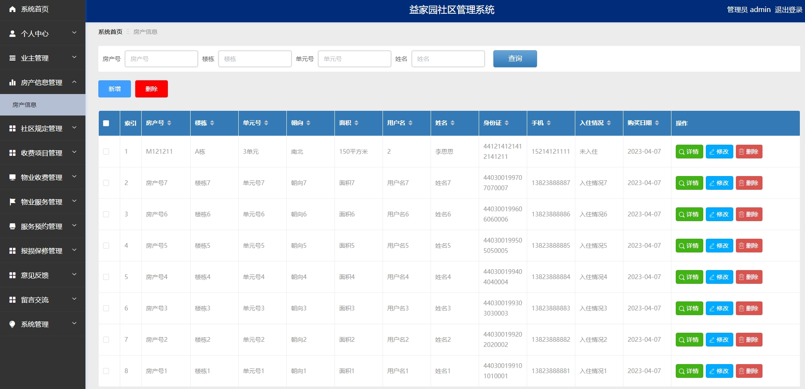
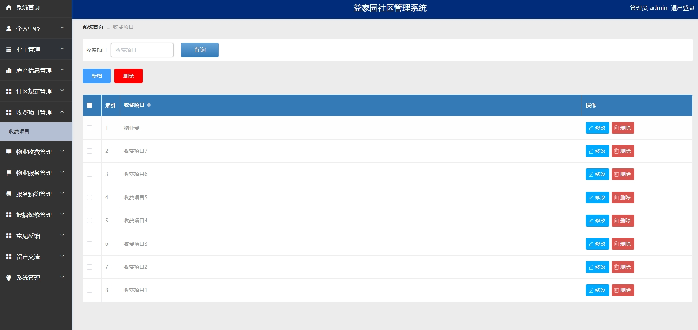
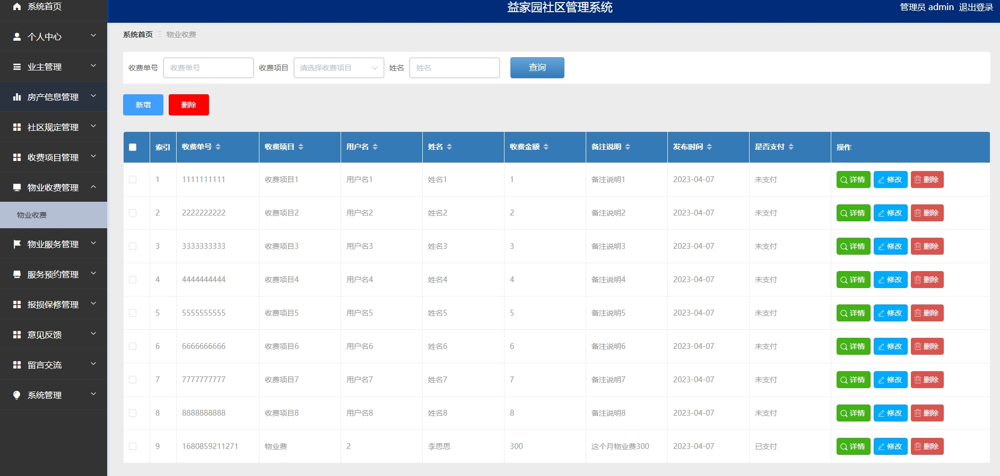
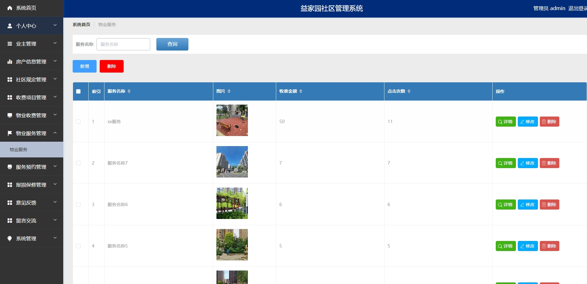
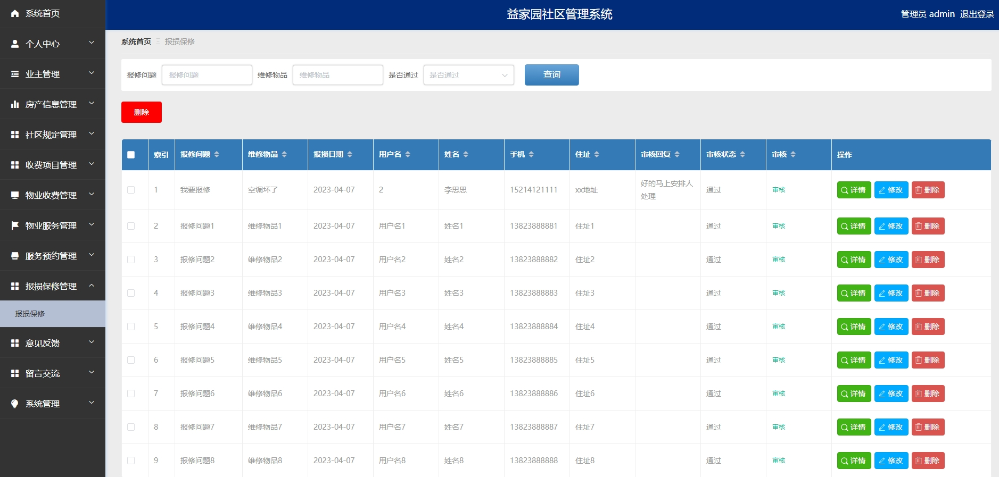
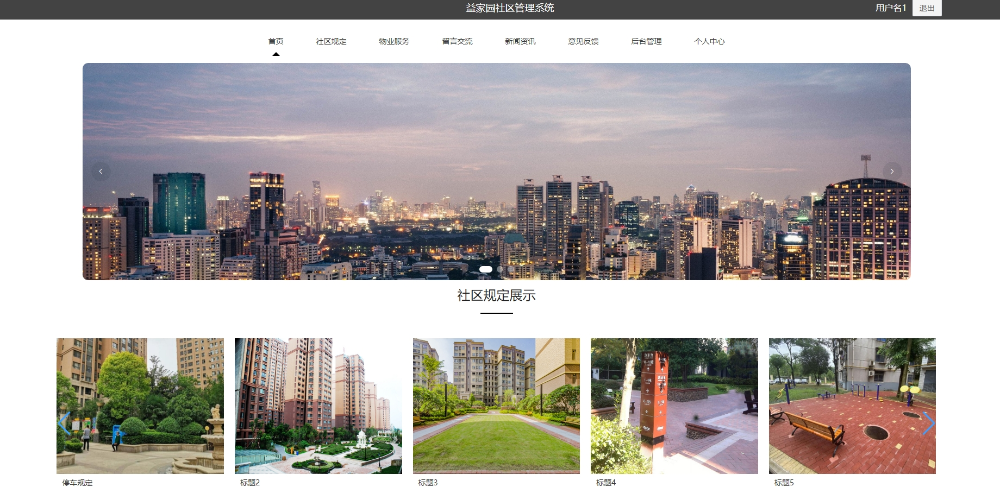
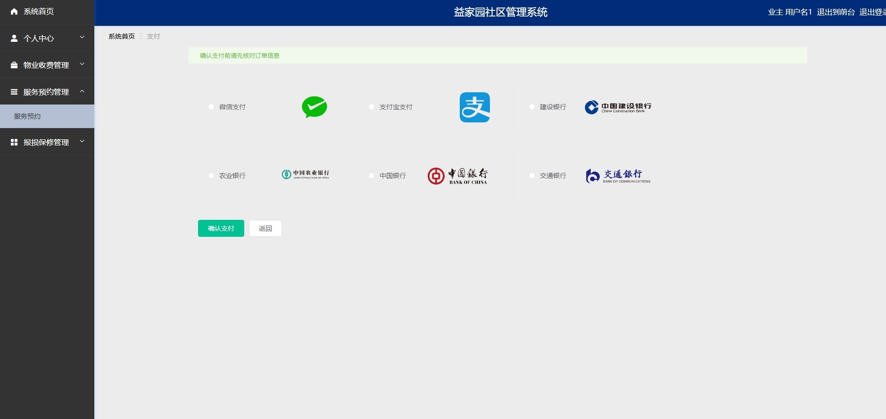
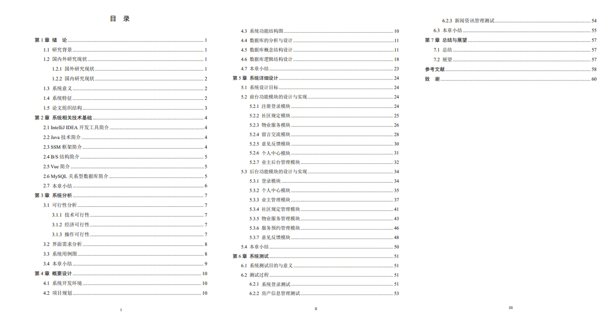

# 1.项目介绍
- 功能模块：管理员（业主管理、房产信息管理、社区规定管理、收费项目管理、物业收费管理、服务预约管理、报损保修管理等）、业主（物业收费管理、服务预约管理、报修管理等）
- 技术栈：SSM， Vue，Druid，fastjson，hutool
- 测试环境：idea2024，MySQL5.7，Maven3，Navicat12，Tomcat8.5
# 2.项目部署
- 通过navicat创建数据库，导入db下的sql文件
- 根据本地数据库环境配置src/main/resources/config.properties  3-5行
- 配置Tomcat，并启动
- 管理员登录：http://localhost:8080/ssmc97nb/admin/dist/index.html  账号密码：admin/admin
- 业主登录：http://localhost:8080/ssmc97nb/front/dist/index.html  账号密码：用户名1/123456， 或查看数据库
# 3.项目部分截图

# 4.获取方式
[戳我查看](https://gitee.com/aven999/mall)